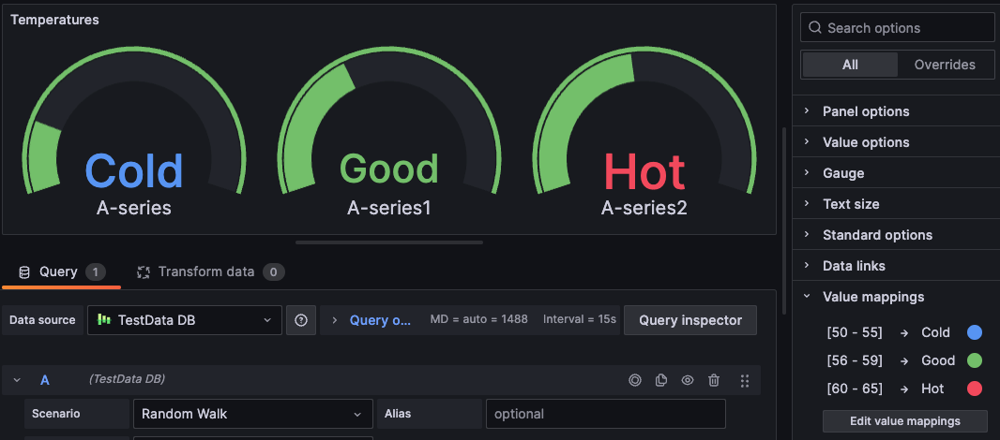

---
aliases:
  - ../panels/configure-value-mappings/
  - ../panels/format-data/
  - ../panels/format-data/about-value-mapping/
  - ../panels/format-data/edit-value-mapping/
  - ../panels/format-data/map-a-range/
  - ../panels/format-data/map-a-regular-expression/
  - ../panels/format-data/map-a-special-value/
  - ../panels/format-data/map-a-value/
  - ../panels/value-mappings/
labels:
  products:
    - cloud
    - enterprise
    - oss
menuTitle: Configure value mappings
title: Configure value mappings
description: Configure value mappings to change how data appears in your visualizations
weight: 90
---

# Configure value mappings

In addition to field overrides, value mapping is a technique you can use to change how data appears in a visualization.

For example, the mapping applied in the following image causes the visualization to display the text `Cold`, `Good`, and `Hot` in blue, green, and red for ranges of temperatures rather than actual temperature values. Using value mappings this way can make data faster and easier to understand and interpret.

Value mappings bypass unit formatting set in the **Standard options** section of panel editor, like color or number of decimal places displayed. When value mappings are present in a panel, Grafana displays a summary of them in the **Value mappings** section of the editor panel.

## Types of value mappings

{}
The new value mappings are not compatible with some visualizations, such as Graph (old), Text, and Heatmap.
{}

Grafana supports the following value mappings:

<!--Update images to match examples -->

- **Value:** Maps text values to a color or different display text. For example, you can configure a value mapping so that all instances of the value `10` appear as **Perfection!** rather than the number. Map a value when you want to format a single value.
  

- **Range:** Maps numerical ranges to a display text and color. For example, if a value is within a certain range, you can configure a range value mapping to display **Low** or **High** rather than the number. Map a range of values when you want to format multiple, continuous values.
  

- **Regex:** Maps regular expressions to replacement text and a color. For example, if a value is `www.example.com`, you can configure a regex value mapping so that Grafana displays **www** and truncates the domain. Map a regular expression when you want to format the text and color of a regular expression value.
  <!--Add an image here-->

- **Special** Maps special values like `Null`, `NaN` (not a number), and boolean values like `true` and `false` to a display text and color. For example, you can configure a special value mapping so that `null` values appear as **N/A**. Map a special value when you want to format uncommon, boolean, or empty values.
  

## Examples

Refer to the following examples to learn more about value mapping.

### Time series example

The following image shows a time series visualization with value mappings. Value mapping colors are not applied to this visualization, but the display text is shown on the axis.

### Stat example

The following image shows a Stat visualization with value mappings and text colors applied. You can hide the sparkline so it doesn't interfere with the values.

### Bar gauge example

The following image shows a bar gauge visualization with value mappings. The value mapping colors are applied to the text, but not to the gauges.

### Table example

The following image shows a table visualization with value mappings. If you want value mapping colors displayed on the table, then set the cell display mode to **Color text** or **Color background**.

## Add a value mapping

1. Open a panel for which you want to map a value.
1. In panel display options, locate the **Value mappings** section and click **Add value mappings**.
1. Click **Add a new mapping** and then select one of the following:

   - **Value** - Enter the value for Grafana to match.
   - **Range** - Enter the beginning and ending values in the range for Grafana to match.
   - **Regex** - Enter the regular expression pattern for Grafana to match.
   - **Special** - Select the special value for Grafana to match.

1. (Optional) Enter display text.
1. (Optional) Set the color.
1. Click **Update** to save the value mapping.
   You can also use the dots on the left to drag and reorder value mappings in the list.

<!--  -->
